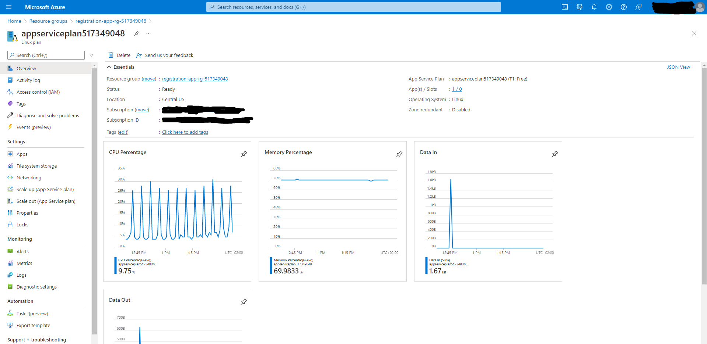
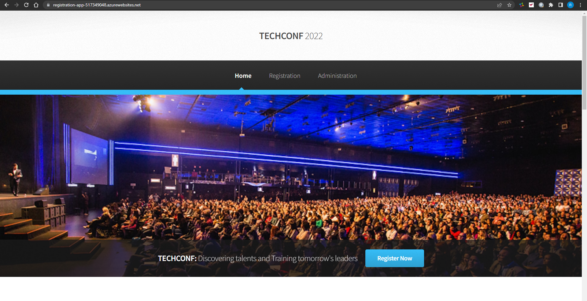
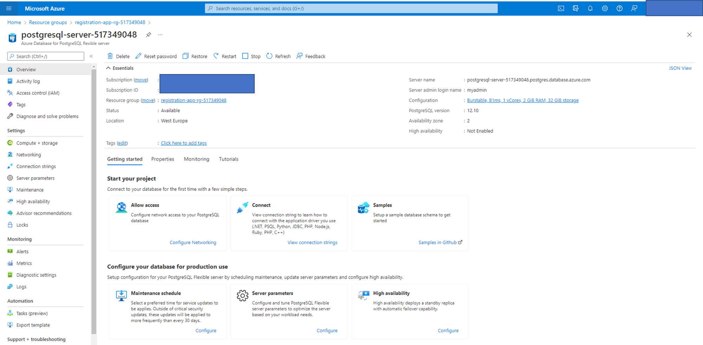
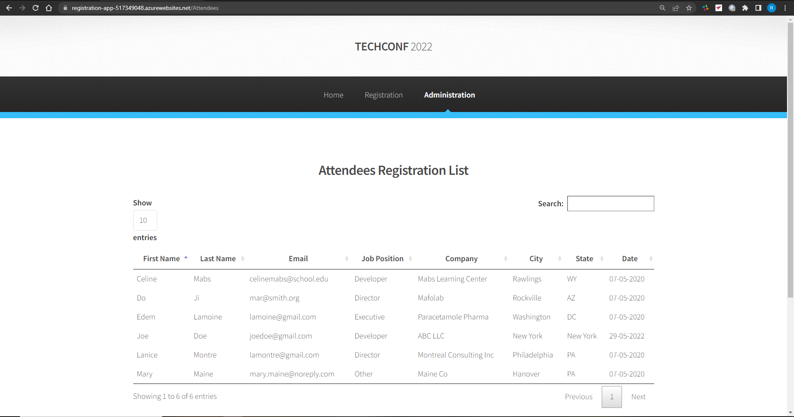
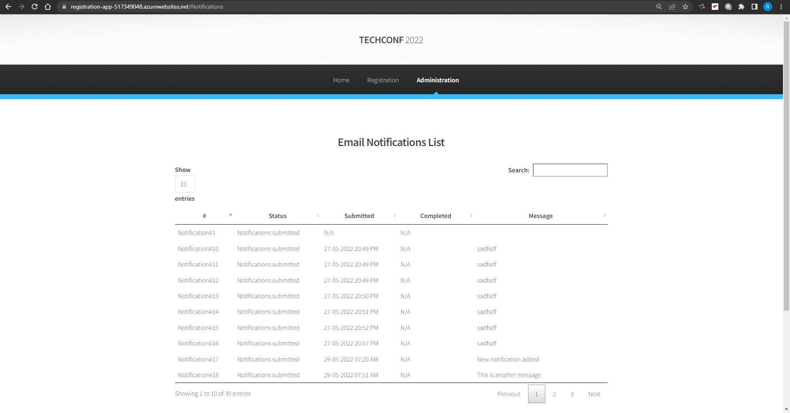
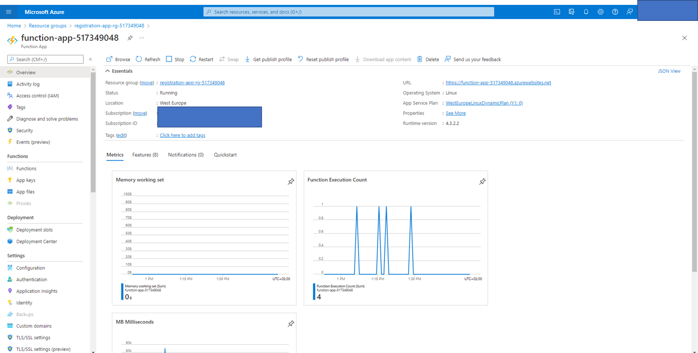
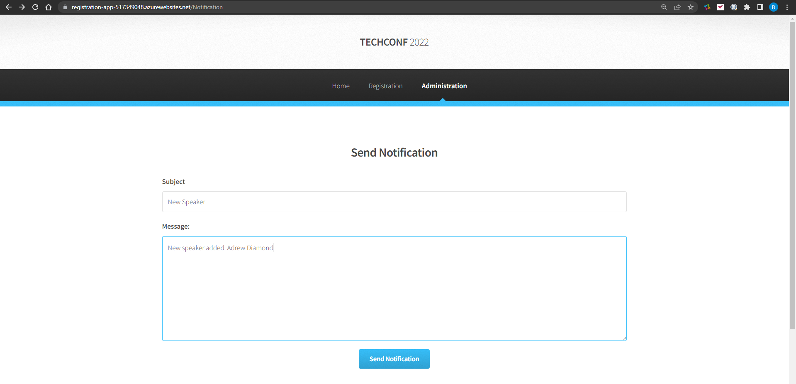
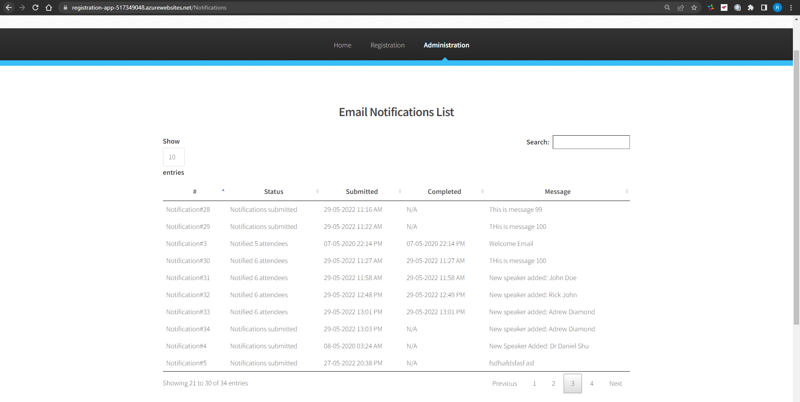
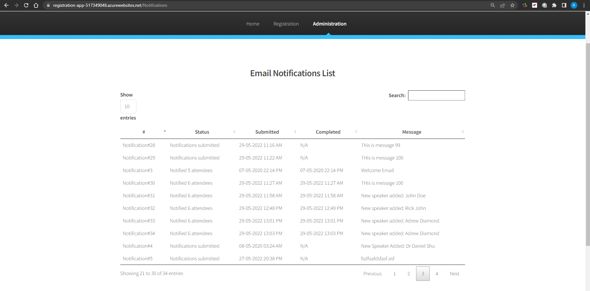

# TechConf Registration Website

## Project Overview

The TechConf website allows attendees to register for an upcoming conference. Administrators can also view the list of attendees and notify all attendees via a personalized email message.

The application is currently working but the following pain points have triggered the need for migration to Azure:

- The web application is not scalable to handle user load at peak
- When the admin sends out notifications, it's currently taking a long time because it's looping through all attendees, resulting in some HTTP timeout exceptions
- The current architecture is not cost-effective

In this project, you worked on the following:

- Migrate and deploy the pre-existing web app to an Azure App Service
- Migrate a PostgreSQL database backup to an Azure Postgres database instance
- Refactor the notification logic to an Azure Function via a service bus queue message

Below are the project steps I have taken to complete the project.

## Dependencies
You will need to install the following locally:

- [Postgres](https://www.postgresql.org/download/)
- [Visual Studio Code](https://code.visualstudio.com/download)
- [Azure Function tools V3](https://docs.microsoft.com/en-us/azure/azure-functions/functions-run-local?tabs=windows%2Ccsharp%2Cbash#install-the-azure-functions-core-tools)
- [Azure CLI](https://docs.microsoft.com/en-us/cli/azure/install-azure-cli?view=azure-cli-latest)
- [Azure Tools for Visual Studio Code](https://marketplace.visualstudio.com/items?itemName=ms-vscode.vscode-node-azure-pack)

## Project Instructions

### Create Azure Resources and Deploy Web App

I have written all commands to create Azure resources (as described in the below) into a bash file that you can run from the root of the project as follows:
```bash
source azure_resources.sh
```
#### Create a Resource group
Create a Resource group by running the following command:
```bash
az group create --name $resourceGroup --location $location
```

#### Create an Azure Postgres Database flexible server
Run the following command to create a PostgreSQL flexible server in the resource group:
```bash
az postgres flexible-server create \
    --name $postgresqlServer \
    --resource-group $resourceGroup \
    --location "$location" \
    --admin-user $adminLogin \
    --admin-password $adminPassword \
    --tier Burstable \
    --sku-name $sku \
    --storage-size 32 \
    --version 12```
```

Allow all IPs to connect to database server by configuring a firewall rule for the server: 
```bash
az postgres flexible-server firewall-rule create \
    --resource-group $resourceGroup \
    --name $postgresqlServer \
    --rule-name AllowAllIps \
    --start-ip-address $startIp \
    --end-ip-address $endIp
```

Add a new database `techconfdb`

First connect locally to your server. You can use `psql` or pgAdmin, which are popular PostgreSQL clients. For this project, we'll connect by using `psql` in our local bash shell. Run the following command in your terminal:
```bash
psql "host=$postgresqlServer.postgres.database.azure.com port=5432 dbname=postgres user=$adminLogin password=$adminPassword sslmode=require"
```

List all databases created by default by typing `\l`

In the same terminal, create a new database called techconfdb:
```bash
CREATE DATABASE techconfdb;
```

To migrate the local database to Azure, restore the database with the backup located in the [data](data) folder:
```bash
PGPASSWORD=$adminPassword psql --file=data/techconfdb_backup.sql --host=$postgresqlServer.postgres.database.azure.com --port=5432 --dbname=techconfdb --username=$adminLogin
```

Validate that the database was migrated by typing the following:
```bash
psql "host=$postgresqlServer.postgres.database.azure.com port=5432 dbname=postgres user=$adminLogin password=$adminPassword sslmode=require"
\c techconfdb
\dt
SELECT * FROM attendee;
SELECT * FROM conference;
SELECT * FROM notification;
```

You should see the database populated with data in each table. For example this shows the conference table with all data:
```bash
techconfdb=> SELECT * FROM conference;
 id |   name   | active |    date    | price |             address              
----+----------+--------+------------+-------+----------------------------------
  1 | TechConf | 1      | 2022-06-10 |   495 | 123 Main St, Baltimore, MD 12345
  2 | TestConf | 0      | 1999-01-01 |     1 | 9
```

#### Create a **Service Bus** resource 
Create a **Service Bus** resource with a `notificationqueue` that will be used to communicate between the web and the function

Run the following command in your terminal to create Service Bus namespace:
```bash
az servicebus namespace create \
    --name $serviceBusNamespace \
    --resource-group $resourceGroup \
    --location $location \
    --sku Basic
```

Run the following command to create a queue in the Service Bus namespace:
```bash
az servicebus queue create \
    --name $serviceBusQueue \
    --namespace-name $serviceBusNamespace \
    --resource-group $resourceGroup
```

We will use the connection string of the Service Bus Namespace to connect to the queue and send / receive messages. Run the following command to list the primary connection string:
```bash
az servicebus namespace authorization-rule keys list \
    --name RootManageSharedAccessKey \
    --namespace-name $serviceBusNamespace \
    --resource-group $resourceGroup \
    --query primaryConnectionString\
    --output table
```

#### Update Configuration file
Open the [web](web) folder and update the following in the `config.py` file
- `POSTGRES_URL`
- `POSTGRES_USER`
- `POSTGRES_PW`
- `POSTGRES_DB`
- `SERVICE_BUS_CONNECTION_STRING`

#### Create a storage account
```bash
az storage account create \
    --name $storageAccount \
    --resource-group $resourceGroup \
    --location $location
```

#### Run web app locally
Test that the web app runs localy before deploying to Azure App Service:

Change into the [web](web) directory
```bash
cd web
```

Install the app's dependencies:
```bash
# install dependencies
pipenv install

# go into the shell
pipenv shell
```

Set a FLASK_APP environment variable tells Flask where to find the app object:
```bash
export FLASK_APP=application.py
```

Run the webapp locally:
```bash
flask run
```

Open the app in a browser using the URL http://127.0.0.1:5000/. You should see the app running.

Stop the Flask server by pressing **Ctrl+C** in the terminal.

#### Create App Service plan and Deploy the web app

From within the [web](web) folder run the following command to create App Service and deploy the flask web app to Azure:
```bash
az webapp up \
    --resource-group $resourceGroup \
    --name $webAppName \
    --plan $appServicePlanName \
    --sku F1 \
    --verbose
```

### Create and Publish an Azure Function
#### Create Azure Function
In the terminal window change to [function](function) directory and run the following command to create the Azure Function project:
```bash
func init --worker-runtime python
```

Create an Azure Function in the [function](function) directory that is triggered by a template - `service bus queue` created in Part 1.
```bash
func new \
    --name ServiceBusQueueTrigger \
    --template "Azure Service Bus Queue trigger"
```

The Azure Function does the following:
- Process the message which is the `notification_id`
- Query the database using `psycopg2` library for the given notification to retrieve the subject and message
- Query the database to retrieve a list of attendees (**email** and **first name**)
- Loop through each attendee and send a personalized subject message
- After the notification, update the notification status with the total number of attendees notified

#### Publish the Azure Function

Create a function app on Azure with given unique name within the resource group:

```bash
az functionapp create \
    --name $functionAppName \
    --resource-group $resourceGroup \
    --storage-account $storageAccount \
    --functions-version 4 \
    --os-type Linux \
    --runtime python \
    --runtime-version 3.8 \
    --consumption-plan-location $location
```    

Test the function locally by first installing the function's dependencies and activating the new environment:

```bash
# install dependencies
pipenv install

# go into the shell
pipenv shell
```

Run the function locally
```bash
func start
```

Deploy the local Functions project to the function app resource we just created in Azure. This is best acomplished through Azure extensions in VS Code. When prompted to upload the setting from `local.settings.json` confirm to automatically process it.

This ensures that the following app settings are added on Azure in the Function's app Applications Settings found under `Settings` -> `Configuration`:

- `POSTGRES_URL`
- `POSTGRES_USER`
- `POSTGRES_PW`
- `POSTGRES_DB`
- `SERVICE_BUS_CONNECTION_STRING`
- `ADMIN_EMAIL_ADDRESS`
- `SENDGRID_API_KEY`


Note the function app URL to use it in the frontend application. The URL looks for example like the following one:

```
https://function-app-517349048.azurewebsites.net
```

### Refactor routes.py

Refactor the post logic in `web/app/routes.py -> notification()` using servicebus `queue_client`

The notification method on POST should save the notification object and queue the notification id for the function to pick it up

Then re-deploy the web app to publish changes to Azure:

```bash
az webapp up \
    --name $webAppName \
    --verbose
```

### Monthly Cost Analysis
A complete month cost analysis of each Azure resource is shown below to give an estimate of total cost using for the given application:

| Azure Resource | Service Tier | Monthly Cost |
| ------------ | ------------ | ------------ |
| *Azure Postgres Database* | Burstable, Standard_B1ms, 32 GiB | $19.01 |
| *Azure Service Bus*   | Basic | $0.05 |
| *Azure App Service Plan* | F1: Free | $0.0 |
| *Azure Function App* | 2mil executions (2000ms/execution) | $1.80 |
| *Azure Storage Account* | StorageV2 (general purpose v2) | $51.41 |
| **Total Cost** |  | $72.27 |

### Architecture Explanation

This section provides an explanation and reasoning for the architecture selection of both the Azure Web App and Azure Function. Spliting the application into Web App and Azure Function ensures modularity and has the advantage of scalability when the load is at peak. of front end user interface and background jobs including all logic behing the UI.

To allow attendees to register for an upcoming conference as well as administrators to view the list of attendees and notify all attendees via a personalized email message, the TechConf website the was migrated to Azure, in order to resolve the following pain points:
    
- Scalability: The web application was deployed to Azure App Service Plan that allows to scale the application to handle user load at peak
- Peformance: Using Service Bus and Queues with Azure Functions as the main orchestrators of the background jobs, ensures that when the admin sends out notifications, these are queued in a Azure Service Bus Queue and an Azure function is triggered when a new queue message is received, which gets rid of HTTP timeout exceptions at peak load and therefore ensures high performance of the application.
- Cost: The new cloud architecture of the migrated application ensures cost-effectivness as well, since the services scaled so that when the application received low traffic, the cost going to be lower than at high volume of traffic.

### Screenshots

#### Migrate Web Applications
Screenshot of Azure Resource showing the **App Service Plan**.



Screenshot of the deployed Web App, showing the URL and application running.




#### Migrate Database
Screenshot of the Azure Resource showing the **Azure Database for PostgreSQL server**.



Screenshot of the Web App successfully loading the list of **attendees** and **notifications** from the deployed website.






#### Migrate Background Process
Screenshot of the Azure Function App running in Azure, showing the **function name** and the **function app plan**.



Screenshot of filled out **Send Notification** form, when submitting a new notification.



Screenshot of the **Email Notifications List** showing the notification status as **Notifications submitted** (Notification processed after executing the Azure function)



Screenshot of the **Email Notifications List** showing the notification status as **Notified X attendees** (Notification processed after executing the Azure function)



### Clean up resources
If you don't plan to use any of the resources that you created, delete them so you don't incur any charges:

```bash
az group delete --name $resourceGroup
```


